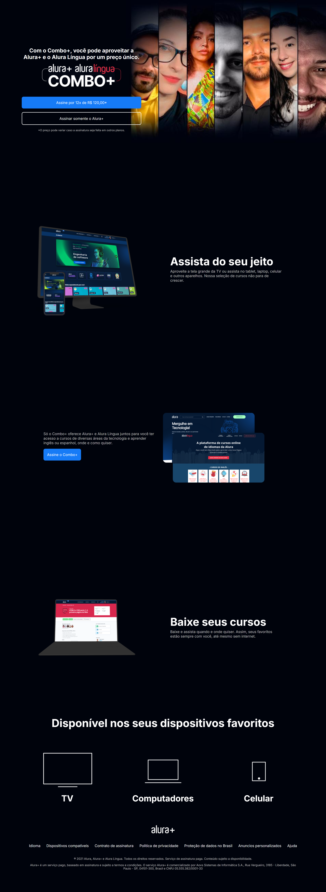

# Alura+ Clone

Este projeto é uma recriação da landing page do Alura+ com HTML e CSS, baseado nos cursos da plataforma [Alura](https://www.alura.com.br/).

## 🔗 Links

- 💼 [Meu LinkedIn](https://www.linkedin.com/in/matheus-mazanti/)
- 💻 [Meu GitHub](https://github.com/mmazanti)
- 🌐 [Deploy do projeto no Vercel](https://alura-plus-self-three-43.vercel.app/)

## 🖼️ Preview do Projeto

Abaixo você pode ver uma prévia da aplicação:

### 💻 Desktop



## 🛠️ Tecnologias Utilizadas

- HTML5
- CSS3
- Flexbox
- Responsividade

## 📦 Como rodar o projeto

1. Clone o repositório:
   ```bash
   git clone https://github.com/mmazanti/alura-plus.git
